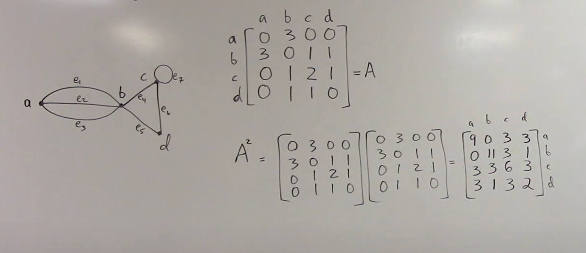

### 1. adjacency matrix

1.1 Square of adjacency matrix
Each of the entries in the squared matrix counts the number of walks of length two between two vertices. For example if row A and colum D value is 3 then there are three walk between A and d

### 2. adjacency List

### computing task in the graph

    1. graph quering task
    2. graph pattern mining task

Ranking the web pages: PageRank
Top-k query - structural information - Attribute - k mean clustering

Community detection:
-social networks

- difference between clustering and community detection
- communities in biological networks

-dual graph

topic for day 2:

// node recommendation task
// influence maximation
